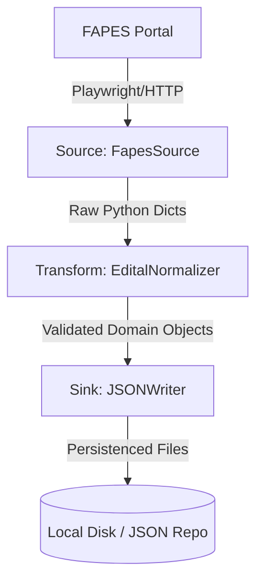

# System Architecture: ETL Pipeline for FAPES Editais

**Author**: Horizon Project Agent
**Date**: 2026-03-08
**Status**: Approved

## Overview
Este documento de arquitetura descreve o design de sistema (System Design Document - SDD) para os pipelines de ETL (Extract, Transform, Load) do projeto `retrieve_edital`. O objetivo central deste sistema é extrair dados brutos de chamadas públicas (editais) do portal da FAPES, normalizá-los e gravá-los como cargas JSON individuais.

## Architecture Diagram

O diagrama abaixo ilustra a arquitetura baseada no padrão T-Shape (Source, Transform, Sink), promovendo um altíssimo desacoplamento entre extração web, regras de negócio e camada de persistência.



## Components

### Component 1: Source (Extract)
- **Responsibility**: Extrair estritamente os dados brutos. Não deve conhecer regras de negócio nem realizar limpezas profundas. Abstraído pela interface `ISource`.
- **Technology Stack**: Python, Playwright
- **Interfaces**: Retorna `List[RawEdital]` ou um conjunto de dicionários nativos.

### Component 2: Transform (Process)
- **Responsibility**: Aplicar validações de domínio, limpeza de strings, remoção de espaços e padronização de nomenclatura de órgãos de fomento. Abstraído pela interface `ITransform`.
- **Technology Stack**: Python puro.
- **Interfaces**: Recebe `RawEdital`, retorna objeto de validação estrita (ex: `EditalDomain`).

### Component 3: Sink (Load)
- **Responsibility**: Receber os objetos de domínio em memória e gravá-los na camada de persistência sob as regras acordadas (1 arquivo JSON formatado por edital). Abstraído pela interface `ISink`.
- **Technology Stack**: Python `json` dinâmico ou adaptadores Cloud.
- **Interfaces**: Recebe `List[EditalDomain]`, salva no destino sem alterar os valores.

## Data Flow

A movimentação da informação segue uma direção imutável através do fluxo (Flow):
1. O processo agendado (Cron via GitHub Actions) inicializa as dependências em memória (`ingest_fapes_flow.py`).
2. O `Source` carrega a página `https://fapes.es.gov.br/difusao-do-conhecimento` e itera a paginação, entregando dados rústicos extraídos da Web.
3. A lista inteira é enviada iterativamente para o `Transform`, que avalia erros em blocos (`try/except`) individuais, removendo dados imprestáveis e tipando os saudáveis.
4. Por fim, a lista enriquecida e limpa é delegada para o `Sink`, que realiza a operação massiva de `I/O` para a criação dos artefatos `edital_[ID].json`.

## Key Design Decisions

### Decision 1: Desacoplamento via Interfaces (Padrão Strategy e SOLID)
- **Contexto**: A FAPES muda com frequência a estrutura do HTML ou a forma como disponibiliza editais.
- **Opções consideradas**: Acoplar script monolítico com requests web, parseamento com Regex misturado e gravação local; OU uso de abstrações isoladas.
- **Decisão**: Adoção estrita de interfaces `ISource`, `ITransform` e `ISink`.
- **Rationale (Motivo)**: Respeitar o princípio do Open/Closed (OCP) e Single Responsibility (SRP). Quando a FAPES mudar, tocaremos apenas na injeção do `Source`, o `Transform` e o `Sink` permanecerão inalterados e a malha de testes intacta.

### Decision 2: 1 Payload JSON por Edital
- **Contexto**: O cliente do projeto estabelece arquivos rígidos de resposta para importação paralela.
- **Decisão**: Configurar o Sink para ignorar listas monolíticas e sobrescrever saídas fragmentadas (ex: `edital_530.json`).
- **Rationale (Motivo)**: Permite atomicidade. Se apenas um edital for alterado, apenas ele vai gerar diff no git ou no storage local.

## Technology Stack
- **Linguagem**: Python 3.12+
- **Extração Web**: Playwright (suporte dinâmico SPA a JavaScript pesado)
- **Validação de Comportamento (BDD)**: `pytest-bdd` (Gherkin specs)
- **Orquestração e CI/CD**: GitHub Actions (Agendamento `cron`)

## Directory Structure

A aderência a esta estrutura é mandatória para respeitar o isolamento arquitetural das diretrizes `clean-code`:

```text
src/
├── core/              # Classes abstratas (ISource, ITransform, ISink) genéricas
├── components/        # Conectores reais
│   ├── sources/       # (Onde FapesSource reside)
│   ├── transforms/    # (Onde EditalNormalizer reside)
│   └── sinks/         # (Onde JSONWriter reside)
├── flows/             # Pipeline orquestrado integrando as partes
└── domain/            # Models de dados base de negócio
```

## Scalability
O sistema escala não pelo volume (existem poucas centenas de editais concorrentes), mas pela manutenção (Adição de novos fomentadores no futuro: FAPEMIG, CNPq). Com as interfaces definidas, escalar é uma questão de criar um novo pacote `<Agencia>Source` e injetar no Flow correspondente.

## Monitoring and Observability
- O fluxo roda em *Headless Mode* dentro de um runner do GitHub Actions.
- Falhas na extração `Source` devem printar logs expressivos para o painel de Actions.
- O BDD atuará como a camada principal garantidora de observabilidade contínua (se a extração ou lógica falhar, a Action lançará alerta vermelho).

## Disaster Recovery
Os resultados persistem atomicamente em `.json` no Storage. Se o `Source` corromper em uma execução noturna, os `.json` anteriores não serão apagados indevidamente (operações destrutivas na base bruta devem ser evitadas ou validadas fortemente antes do flush).
