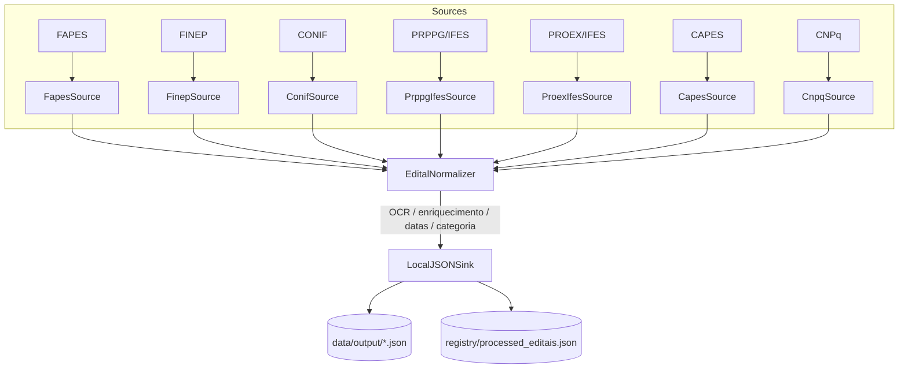

# System Architecture: ETL Pipeline de Editais

**Author**: Horizon Project Agent
**Date**: 2026-03-31
**Status**: Approved

## Overview

Este documento descreve a arquitetura ETL do projeto `retrieve_edital`. O sistema extrai editais públicos de múltiplos fomentadores e portais institucionais, normaliza os dados em um formato comum e persiste um arquivo JSON por edital em `data/output/`.

Atualmente o repositório mantém fluxos dedicados para **FAPES**, **FINEP**, **CONIF**, **PRPPG/IFES**, **PROEX/IFES**, **CAPES** e **CNPq**, todos apoiados pelas mesmas interfaces `ISource`, `ITransform` e `ISink`.

## Architecture Diagram

Padrão T-Shape (Source, Transform, Sink); múltiplos Sources podem ser injetados no mesmo Transform e Sink.



## Fluxos (Flows)

| Fluxo | Arquivo | Source | Descrição |
|-------|---------|--------|-----------|
| FAPES | `src/flows/ingest_fapes_flow.py` | `FapesSource` | Editais FAPES em múltiplas seções, com OCR Mistral quando há PDF principal. |
| FINEP | `src/flows/ingest_finep_flow.py` | `FinepSource` | Chamadas abertas com página de detalhe, cronograma, tags, anexos e filtro por ano de prazo. |
| CONIF | `src/flows/ingest_conif_flow.py` | `ConifSource` | Editais do ano corrente, com leitura da página de detalhe e OCR do PDF principal. |
| PRPPG_IFES | `src/flows/ingest_prppg_ifes_flow.py` | `PrppgIfesSource` | Editais do SIGPesq/Ifes com paginação ASP.NET, URL estável `?cod=` e download do anexo principal. |
| PROEX_IFES | `src/flows/ingest_proex_ifes_flow.py` | `ProexIfesSource` | Editais abertos da PROEX/IFES, limitados ao ano corrente, com deduplicação pela URL do PDF principal e fallback para `curl` quando o portal retorna `403` a `requests`. |
| CAPES | `src/flows/ingest_capes_flow.py` | `CapesSource` | Editais e resultados da CAPES, com anexos em PDF e filtro por ano corrente/futuro. |
| CNPQ | `src/flows/ingest_cnpq_flow.py` | `CnpqSource` | Chamadas públicas abertas do portal legado do CNPq, com filtro por encerramento. |

## Configuração global

- `src/config.py`: `get_reference_year(override)` para fontes que filtram por ano de referência.
- `.env`: `MISTRAL_API_KEY` para OCR e extrações estruturadas via Mistral.
- `registry/processed_editais.json`: índice de editais já processados por source (`fapes`, `finep`, `conif`, `prppg_ifes`, `proex_ifes`, `capes`, `cnpq`).
- `docs/flow_processing_log.md`: log operacional da última execução de cada fluxo.
- `scripts/run_all_flows.py`: runner unificado para todos os fluxos.

## Components

### Component 1: Source (Extract)

- **Responsibility**: extrair dados brutos e montar `RawEdital`, sem aplicar regras finais de normalização.
- **Implementações atuais**:
  - `FapesSource`
  - `FinepSource`
  - `ConifSource`
  - `PrppgIfesSource`
  - `ProexIfesSource`
  - `CapesSource`
  - `CnpqSource`

**Destaque PROEX/IFES**:
- lê `https://proex.ifes.edu.br/editais`
- isola o bloco `Editais abertos` do ano corrente
- cria um `RawEdital` por edital
- preserva anexos documentais (`pdf`, `doc`, `docx`, `odt`, etc.)
- escolhe o PDF principal com heurística baseada em rótulos como `Edital` e `Retificação`
- usa fallback com `curl` para listagem e downloads quando o portal ou a AGIFES respondem `403` para `requests`

### Component 2: Transform (Process)

- **Responsibility**: validar e normalizar `RawEdital` em `EditalDomain`.
- **Atribuições principais**:
  - normalização de título e órgão
  - mapeamento de `raw_cronograma` para `cronograma`, `data_abertura` e `data_encerramento`
  - OCR e extração estruturada com Mistral quando `pdf_content` está disponível
  - fallback por descrição/título quando não há extração completa

### Component 3: Sink (Load)

- **Responsibility**: gravar um JSON por edital e manter a saída persistida.
- **Implementação**: `LocalJSONSink`
- **Saída**: `data/output/*.json`

## Data Flow

1. O flow dedicado carrega o conjunto já processado em `registry/processed_editais.json`.
2. O source lê a origem remota e devolve `List[RawEdital]`.
3. `EditalNormalizer` processa os itens em paralelo (`ThreadPoolExecutor(max_workers=2)`).
4. `LocalJSONSink.write()` persiste os `EditalDomain`.
5. O flow registra as chaves processadas no `registry`.
6. O runner unificado atualiza `docs/flow_processing_log.md` quando executado via `scripts/run_all_flows.py`.

## Runner e workflow

- `scripts/run_all_flows.py` executa os fluxos na ordem:
  `FAPES` → `FINEP` → `CONIF` → `PRPPG_IFES` → `PROEX_IFES` → `CAPES` → `CNPQ`.
- `.github/workflows/run_scraper.yml` chama o runner unificado e deve persistir:
  - `data/output/*.json`
  - `registry/processed_editais.json`
  - `docs/flow_processing_log.md`

## Key Design Decisions

### Decision 1: Reuso do núcleo ETL por interfaces

- **Contexto**: cada portal expõe HTML, paginação e anexos de forma diferente.
- **Decisão**: manter `ISource`, `ITransform` e `ISink` como contratos estáveis.
- **Rationale**: novos fomentadores entram como novos sources/flows, sem quebrar a malha principal.

### Decision 2: Deduplicação por chave específica do source

- **Contexto**: nem todo portal oferece uma página de detalhe estável.
- **Decisão**:
  - FAPES: chave pelo basename do arquivo
  - PRPPG/IFES: URL estável `?cod=...`
  - PROEX/IFES: URL do PDF principal do edital
  - demais fontes: permalink ou link principal do item
- **Rationale**: evita reprocessamento mesmo quando a listagem não possui identificador único uniforme.

### Decision 3: Fallback de rede para PROEX/IFES

- **Contexto**: em 2026-03-31 o portal `proex.ifes.edu.br` e links hospedados na AGIFES responderam `403 Forbidden` para `requests`, mas aceitaram `curl -L`.
- **Decisão**: incorporar fallback com `curl` apenas no `ProexIfesSource` para listagem e PDFs.
- **Rationale**: mantém o fluxo funcional sem alterar os demais sources ou exigir browser headless para esse portal estático.

## Technology Stack

- **Linguagem**: Python 3.12+
- **Extração Web**: `requests`, `BeautifulSoup`, `Playwright`, `curl` como fallback pontual na PROEX/IFES
- **Normalização**: Python + `EditalNormalizer`
- **OCR / Enriquecimento**: Mistral
- **Testes**: `pytest`, `pytest-bdd`
- **Automação**: GitHub Actions

## Directory Structure

```text
src/
├── processed_store.py
├── core/
├── domain/
├── components/
│   ├── sources/
│   │   ├── fapes_source.py
│   │   ├── finep_source.py
│   │   ├── conif_source.py
│   │   ├── prppg_ifes_source.py
│   │   ├── proex_ifes_source.py
│   │   ├── capes_source.py
│   │   └── cnpq_source.py
│   ├── transforms/
│   └── sinks/
└── flows/
    ├── ingest_fapes_flow.py
    ├── ingest_finep_flow.py
    ├── ingest_conif_flow.py
    ├── ingest_prppg_ifes_flow.py
    ├── ingest_proex_ifes_flow.py
    ├── ingest_capes_flow.py
    └── ingest_cnpq_flow.py
```

## Monitoring and Observability

- logs estruturam início, extração, transformação e persistência
- `docs/flow_processing_log.md` registra execuções operacionais relevantes
- a suíte `pytest` valida parsing, deduplicação, runner e regras específicas por source

## Disaster Recovery

- a persistência é atômica por arquivo JSON
- o registry mantém o estado incremental por source
- reruns controlados podem ser feitos limpando apenas a chave específica do source no `registry`, sem afetar os demais
