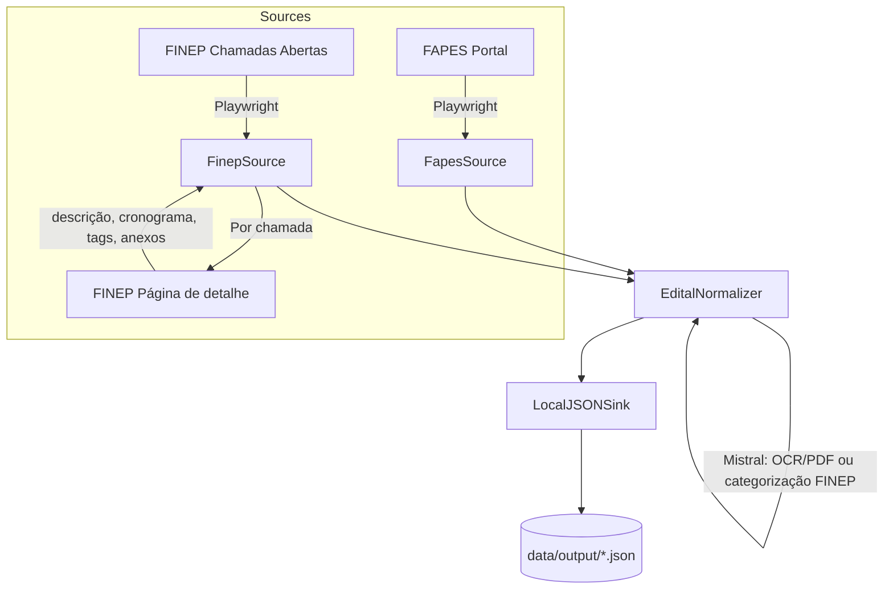

# System Architecture: ETL Pipeline (FAPES e FINEP)

**Author**: Horizon Project Agent
**Date**: 2026-03-15
**Status**: Approved

## Overview
Este documento descreve o design dos pipelines ETL (Extract, Transform, Load) do projeto `retrieve_edital`. O sistema extrai dados de chamadas públicas (editais) de **FAPES** e **FINEP**, normaliza e grava um JSON por edital em `data/output/`.

## Architecture Diagram

Padrão T-Shape (Source, Transform, Sink); múltiplos Sources podem ser injetados no mesmo Transform e Sink.



## Fluxos (Flows)

| Fluxo | Arquivo | Source | Descrição |
|-------|---------|--------|-----------|
| FAPES | `src/flows/ingest_fapes_flow.py` | `FapesSource` | Editais FAPES (múltiplas URLs), PDF + Mistral OCR quando disponível, carga incremental por títulos já persistidos. |
| FINEP | `src/flows/ingest_finep_flow.py` | `FinepSource` | Chamadas abertas FINEP; para cada link, acessa a página de detalhe e extrai descrição, cronograma, Tema(s)→tags, tabela Documentos→anexos; categorização Mistral (divulgação de conhecimento / extensão / inovação). Filtro de prazo por ano (`REFERENCE_YEAR`). |

## Configuração global

- **`src/config.py`**: `get_reference_year(override)` — ano de referência para filtro de prazos (FINEP). Ordem: parâmetro > env `REFERENCE_YEAR` > ano atual.
- **`.env`**: `MISTRAL_API_KEY` (obrigatório para Mistral OCR e categorização FINEP), opcionalmente `REFERENCE_YEAR`.

## Components

### Component 1: Source (Extract)
- **Responsibility**: Extrair dados brutos. Não aplica regras de negócio profundas. Abstraído por `ISource`.
- **Implementações**:
  - **FapesSource**: Múltiplas URLs FAPES, paginação, download de PDFs, classificação de títulos (Mistral), retorna `List[RawEdital]`.
  - **FinepSource**: Listagem FINEP (situação=aberta), filtro por ano de prazo; para cada resultado abre a página de detalhe e preenche descrição, cronograma, tags, anexos em `RawEdital` (campos `raw_cronograma`, `raw_tags`, `raw_anexos`). Ver [finep_source.md](finep_source.md).

### Component 2: Transform (Process)
- **Responsibility**: Validar e normalizar para `EditalDomain`; aplicar regras de datas (data de publicação → `data_abertura`, prazo de envio → `data_encerramento`); para FINEP, categorizar via Mistral (divulgação de conhecimento / extensão / inovação) com base na descrição.
- **Technology Stack**: Python, Mistral (OCR para PDF FAPES; chat para categorização FINEP).
- **Interfaces**: Recebe `RawEdital`, retorna `EditalDomain`.

### Component 3: Sink (Load)
- **Responsibility**: Gravar `List[EditalDomain]` em arquivos JSON (1 por edital) em `data/output/`. Abstraído por `ISink`.
- **Implementação**: `LocalJSONSink`.

## Data Flow

1. **Fluxo FAPES**: `ingest_fapes_flow` → `FapesSource.read()` (paginação, PDFs, classificação) → `EditalNormalizer.process()` (com ou sem Mistral OCR por item) → `LocalJSONSink.write()`.
2. **Fluxo FINEP**: `ingest_finep_flow` → `FinepSource.read()` (listagem + uma requisição por página de detalhe) → `EditalNormalizer.process()` (usa `raw_cronograma`/`raw_tags`/`raw_anexos` e chama Mistral para categoria) → `LocalJSONSink.write()`.

## Key Design Decisions

### Decision 1: Desacoplamento via Interfaces (Padrão Strategy e SOLID)
- **Contexto**: A FAPES muda com frequência a estrutura do HTML ou a forma como disponibiliza editais.
- **Opções consideradas**: Acoplar script monolítico com requests web, parseamento com Regex misturado e gravação local; OU uso de abstrações isoladas.
- **Decisão**: Adoção estrita de interfaces `ISource`, `ITransform` e `ISink`.
- **Rationale (Motivo)**: Respeitar o princípio do Open/Closed (OCP) e Single Responsibility (SRP). Quando a FAPES mudar, tocaremos apenas na injeção do `Source`, o `Transform` e o `Sink` permanecerão inalterados e a malha de testes intacta.

### Decision 2: 1 Payload JSON por Edital
- **Contexto**: O cliente do projeto estabelece arquivos rígidos de resposta para importação paralela.
- **Decisão**: Configurar o Sink para ignorar listas monolíticas e sobrescrever saídas fragmentadas (ex: `edital_530.json`).
- **Rationale (Motivo)**: Permite atomicidade. Se apenas um edital for alterado, apenas ele vai gerar diff no git ou no storage local.

## Technology Stack
- **Linguagem**: Python 3.12+
- **Extração Web**: Playwright (suporte dinâmico SPA a JavaScript pesado)
- **Validação de Comportamento (BDD)**: `pytest-bdd` (Gherkin specs)
- **Orquestração e CI/CD**: GitHub Actions (Agendamento `cron`)

## Directory Structure

```text
src/
├── config.py          # get_reference_year() — REFERENCE_YEAR / ano atual
├── core/              # ISource, ITransform, ISink
├── domain/            # RawEdital (incl. raw_cronograma, raw_tags, raw_anexos), EditalDomain
├── components/
│   ├── sources/       # FapesSource, FinepSource
│   ├── transforms/    # EditalNormalizer, date_utils, mistral_client
│   └── sinks/         # LocalJSONSink
└── flows/             # ingest_fapes_flow, ingest_finep_flow
```

## Modelo de dados (extensões para FINEP)

- **RawEdital** pode carregar dados já estruturados da página de detalhe:
  - `raw_cronograma`: lista `[{"evento": "...", "data": "YYYY-MM-DD"}]` (ex.: data de publicação, prazo de envio).
  - `raw_tags`: lista de strings (ex.: temas do campo Tema(s)).
  - `raw_anexos`: lista `[{"titulo": "...", "link": "...", "tipo": "Documentos"}]` (tabela Documentos da FINEP).
- O **EditalNormalizer** usa esses campos quando presentes e mapeia datas para `data_abertura` / `data_encerramento`; para FINEP ainda chama Mistral para definir `categoria`.

## Scalability
O sistema escala pela manutenção: novos fomentadores (FAPEMIG, CNPq, etc.) exigem um novo `*Source` e um flow que o injete. As interfaces `ISource`, `ITransform` e `ISink` permanecem estáveis.

## Monitoring and Observability
- O fluxo roda em *Headless Mode* dentro de um runner do GitHub Actions.
- Falhas na extração `Source` devem printar logs expressivos para o painel de Actions.
- O BDD atuará como a camada principal garantidora de observabilidade contínua (se a extração ou lógica falhar, a Action lançará alerta vermelho).

## Disaster Recovery
Os resultados persistem atomicamente em `.json` no Storage. Se o `Source` corromper em uma execução noturna, os `.json` anteriores não serão apagados indevidamente (operações destrutivas na base bruta devem ser evitadas ou validadas fortemente antes do flush).
